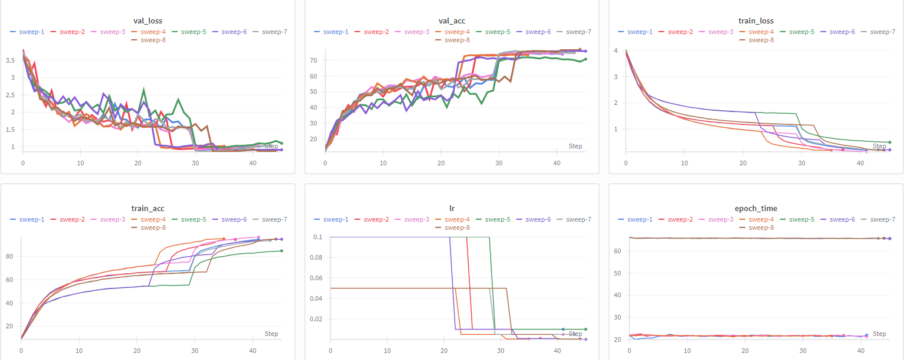
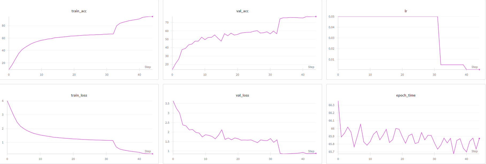
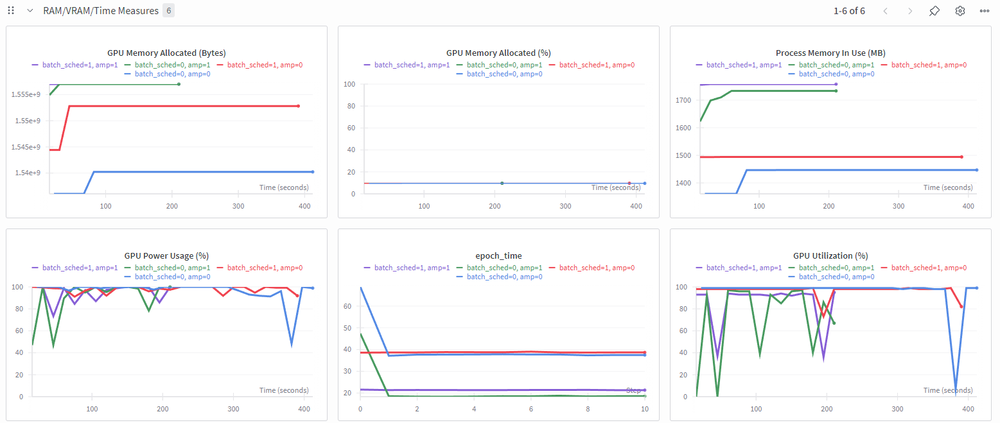
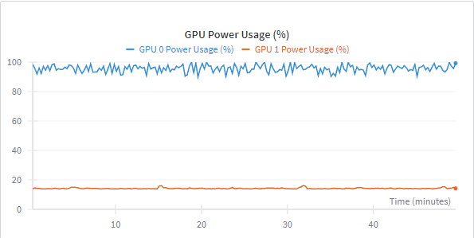
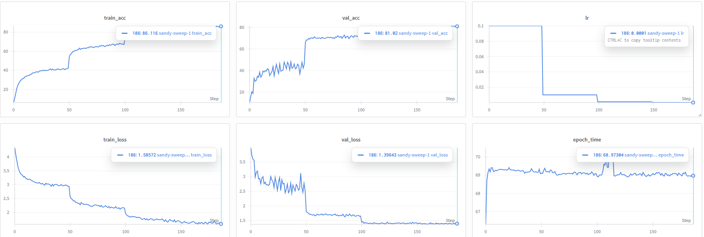
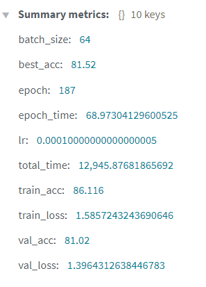
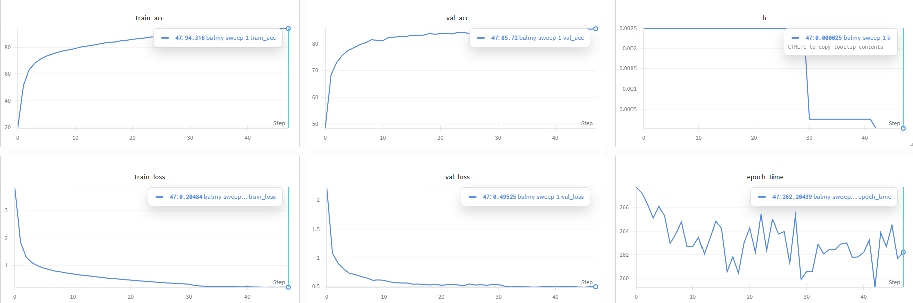
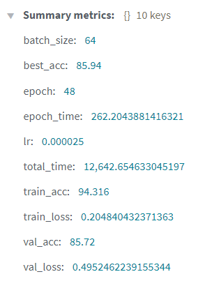

# ATNN HOMEWORK 3 REPORT
## Hyperparam sweep 70% Acc CIFAR-100

The sweep was built to find out the effects of the chosen model, LR and scheduler on accuracy primarily.  
This was done with the goal of finding the best 'base' config(s) from which to achieve the higher accuracy targets later on.
### Configs
Training Data Augmentations: RandomCrop, RandomHorizontalFlip, Normalization with CIFAR-100 Mean Std.

TTA: Resizing, CenterCrop.

Any params not listed below ( such as use_cutmix, used later on ) default to false.

Constant config params:
* pretrained: false
* optimizer: SGD
* epochs: 200
* weight decay: 5e-4
* num_workers: 2
* pin_memory: true
* use_amp: true
* use_wandb: true
* batch-size: 128 if resnet18, 64 if resnet50

Varied config params:
* model: resnet18, resnet50
* lr: 0.1, 0.05
* scheduler: StepLR, ReduceLROnPlateau

### Results

| Model    | LR   | Scheduler         | Test Accuracy (%) | Training Time (min) | Notes |
| -------- | ---- | ----------------- | ----------------- | ------------------- | ----- |
| resnet18 | 0.1  | StepLR            | 74.53             | 15.13               |       |
| resnet18 | 0.1  | ReduceLROnPlateau | 74.68             | 13.82               |       |
| resnet18 | 0.05 | StepLR            | 74.71             | 15.28               |       |
| resnet18 | 0.05 | ReduceLROnPlateau | 73.56             | **13.06**           |       |
| resnet50 | 0.1  | StepLR            | 71.98             | 50.58               |       |
| resnet50 | 0.1  | ReduceLROnPlateau | 75.96             | 50.62               |       |
| resnet50 | 0.05 | StepLR            | 76.06             | 48.42               |       |
| resnet50 | 0.05 | ReduceLROnPlateau | **77.05**         | 49.62               |       |

*Table of the Test Accuracy and Training time*

Resnet50 tends to have a higher ceiling for accuracy, but seems more unstable/sensitive to hyperparams than Resnet18.   
Specifically, with a minimal change to LR the accuracy jumped from 71.98 to 76.06.

Resnet18 is more stable but caps out a bit lower. It is also much faster, as to be expected due to fewer layers and params. 

For Resnet50, ReduceLR yields marginally better results.

*Sweep Charts of 8 configs*

*Best config of the sweep*

## Pipeline efficiency
Picture above is also relevant to this topic: epoch_time ~60 seconds or below on a basic configuration.
* AMP was enabled to reduce VRAM usage by using FP16 for certain operations. This means a drop in epoch run time without majorly affecting accuracy.
* Batch size scheduler can be used to dynamically adjust batch size for GPUs that do not run into memory issues
* pin_memory=True for faster transfers to GPU
* num_workers=2 to avoid CPU bottlenecks
* torchvision.transforms for efficient transforms on GPU
* minimal data augmentation by default: the sweep of 8 configs uses few and simple/cheap augmentations 

Below is a comparison of the effects use_batch_scheduler and use_amp had on a test run.

*RAM VRAM Runtime Charts*

GPU Usage stays high during training, which indicates efficiency.

Below is an example of GPU Power Usage for the best run in the sweep of 8 configs.( \* only one of the GPUs on the platform was used )

  
*Best config of sweep GPU Power Usage*

## No pretraining Vs Pretraining

### No pretraining
| Model    | Optimizer | LR    | Scheduler                | Epochs | WD   | Heavy Aug | MixUp            | CutMix   | Smoothing | Patience |
| -------- | --------- | ----- | -----------------------  | ------ | ---- | --------- | ---------------  | ------   | --------- | -------- |
| resnet50 | SGD       | 0.1   |  StepLR (step_size=50)   | 200    | 5e-4 | True      | True (α=0.2) | True (α=0.2) |   0.1     |   20     |

Heavy Augmentation adds RandomErasing.  
The network is adapted for models with no pretraining by changing the first convolution and maxpool, in order to work with 32x32 data. 

*No pretraining WANDB Charts*

  
*No pretraining Summary*

### Pretraining
| Model    | Optimizer | LR    | Scheduler                | Epochs | WD   | 
| -------- | --------- | ----- | -----------------------  | ------ | ---- |
| resnet50 | SGD       | 0.01  |  ReduceLROnPlateau       |  100   | 5e-4 |

Pretrained models include Resizing. (256 to be larger than 224x224 ). This was done to mimic ImageNet's standard preprocessing, as per this [article](https://www.pinecone.io/learn/series/image-search/imagenet/), to make sure the data is compatible with pretrained weights.

The pretrained + SGD config uses three parameter groups and assigns a different LR for each ( progressive fine-tuning ). The last group ( final block of layers and the final classification layer ) uses the original LR, so it can change the most during training. The block of layers before it is trained with half of the original LR. Early layers in the network ( first convolution and normalization layers, first two blocks of layers ) use a fourth of the original LR, meaning that during training it does not forget the learned features from the ImageNet dataset.

Additionally, pretrained models have ColorJitter and RandomErasing.  
I did not attempt other augmentations to achieve the desired accuracy in a more efficient timeframe. These latter heavy augmentations could potentially be removed as their usefulness is not certain, rather just an inspiration from another [experiment](https://dev.to/amirali_soltanirad/8435-on-cifar-100-with-resnet-50-4j4b). 

*Pretraining WANDB Charts*

  
*Pretraining WANDB Summary*

## Setup & How to Run
The pipeline can be run in multiple ways:
1. python file ( accepts CLI args / config files )
    * cd to root/
    * pip install -r requirements.txt
    * python homework3.py --config ./configs/file_name.yaml
    * python homework3.py --config ./configs/file_name.yaml --override model=resnet18

2. jupyter notebook ( hard-code sweep ); tested platforms:
    * kaggle: set Addons -> Kaggle Secret for WANDB key, set Settings -> Accelerator T4
    * google colab ( both browser & VS Code extension ): set .env for WANDB_API_KEY, set Runtime -> Runtime Type T4
    * lightning.ai: set .env for WANDB KEY

## Score estimate

My main concern is the Efficiency Criteria, as there may be different techniques which could have been employed yet were not.
For example, I did not attempt to utilize both GPUs.
The pipeline also could not make use of `torch.compile`: `Not enough SMs to use max_autotune_gemm mode`

There may be other methods that I was unaware of or had forgotten to include.

Another point of concern would be the Hyperparameter Sweep Criteria and the diversity of the configs. While other sweeps were tested ( with AdamW optimizers, for example ) they did not include exactly 8 or more configs. Their results may be interesting or significant, however for the sake of consistency in the WANDB sweep and tracking all 8 configs in the same charts, I picked this particular sweep, which also had simpler variations. 

