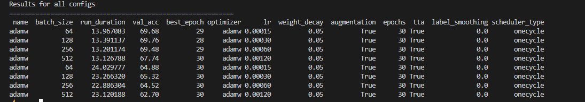
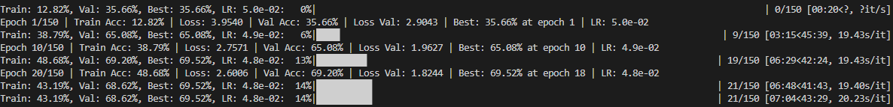

# CARN_HW2

Part of the result prints in here are from experiments ran on GPU Providers other than Kaggle, therefore when the source code is necessary, instead of notebook links, there will be either snippets of the relevant configurations or python files of the entire experiment.

---

## Batch size & Data Augmentation ‘Strength’

The following screenshot shows the time and accuracy difference between configurations with ‘light’ DA ( first 4 ) and ‘heavier’ DA ( last 4 ): Excessive augmentation lead to longer runtime yet lower accuracy on the validation set.

Additionaly, the difference casue by various batch_size values are shown. 

Of note, all batch size values performed equally well, with the sole exception of value 512.



```python
results.append(run_experiment("adamw", optimizer_type="adamw", batch_size=64, lr=0.00015, epochs=30, augmentation=True, tta=True, weight_decay=0.05,scheduler_type="onecycle"))# results.append(run_experiment("rmsprop", "rmsprop", lr=0.001, epochs=50, augmentation=True, tta=False, weight_decay=0.0005,scheduler_type="cosine_annealing"))
results.append(run_experiment("adamw", optimizer_type="adamw", batch_size=128, lr=0.0003, epochs=30, augmentation=True, tta=True, weight_decay=0.05,scheduler_type="onecycle"))
results.append(run_experiment("adamw", optimizer_type="adamw", batch_size=256, lr=0.0006, epochs=30, augmentation=True, tta=True, weight_decay=0.05,scheduler_type="onecycle"))# results.append(run_experiment("rmsprop", "rmsprop", lr=0.001, epochs=50, augmentation=True, tta=False, weight_decay=0.0005,scheduler_type="cosine_annealing"))
results.append(run_experiment("adamw", optimizer_type="adamw", batch_size=512, lr=0.0012, epochs=30, augmentation=True, tta=True, weight_decay=0.05,scheduler_type="onecycle"))# results.append(run_experiment("rmsprop", "rmsprop", lr=0.001, epochs=50, augmentation=True, tta=False, weight_decay=0.0005,scheduler_type="cosine_annealing"))

```

```python
train_transforms = v2.Compose([
    v2.ToImage(),
    v2.RandomHorizontalFlip(p=0.5), 
    v2.RandomCrop(32, padding=2),
    v2.ToDtype(torch.float32, scale=True),
    v2.Normalize(MEAN, STD, inplace=True)
])

train_transforms_heavy = v2.Compose([
    v2.ToImage(),
    v2.RandomCrop([32, 32], padding=4, padding_mode='reflect'),
    v2.RandomHorizontalFlip(p=0.5),
    v2.RandomRotation(degrees=10),
    v2.ColorJitter(brightness=0.3, contrast=0.3, saturation=0.3, hue=0.1),
    v2.RandomGrayscale(p=0.1),
    v2.GaussianBlur(kernel_size=3, sigma=(0.1, 2.0)),
    v2.ToDtype(torch.float32, scale=True),
    v2.Normalize(MEAN, STD, inplace=True)
]
```

Another configuration comparing DA effectiveness:


```python
train_transforms_minimal = v2.Compose([
    v2.ToImage(),
    v2.RandomCrop(32, padding=4),
    v2.ToDtype(torch.float32, scale=True),
    v2.Normalize(MEAN, STD, inplace=True)
])

train_transforms_medium = v2.Compose([
    v2.ToImage(),
    v2.RandomCrop(32, padding=4, padding_mode='reflect'),
    v2.RandomHorizontalFlip(p=0.5),
    v2.ColorJitter(brightness=0.2, contrast=0.2, saturation=0.2),
    v2.RandomErasing(p=0.25, scale=(0.02, 0.15)),
    v2.ToDtype(torch.float32, scale=True),
    v2.Normalize(MEAN, STD, inplace=True)
])
train_transforms_strong = v2.Compose([
    v2.ToImage(),
    v2.RandomCrop(32, padding=4, padding_mode='reflect'),
    v2.RandomHorizontalFlip(p=0.5),
    v2.ColorJitter(brightness=0.3, contrast=0.3, saturation=0.3),
    v2.RandomAffine(degrees=0, translate=(0.1, 0.1)),
    v2.RandomErasing(p=0.3, scale=(0.02, 0.2)),
    v2.ToDtype(torch.float32, scale=True),
    v2.Normalize(MEAN, STD, inplace=True)
])

# Code snippet from (Version 14 multiple tests for muon,lr,augs) of the notebook.
```
(Version 14 Notebook)[https://www.kaggle.com/code/gavrilstefandorian/carn-hw2?scriptVersionId=271200529]


Similarly, using AutoAugment with the SVHN Policy ( alongside lighter DA to balance it out ) had  a similar result, running for longer yet resulting in a lower accuracy value.


```python
train_transforms_heavy = v2.Compose([
    v2.ToImage(),
    v2.RandomCrop([32, 32], padding=4),
    v2.AutoAugment(v2.AutoAugmentPolicy.SVHN),
    v2.ToDtype(torch.float32, scale=True),
    v2.Normalize(MEAN, STD, inplace=True)
])
```

## AdamW optimizer + OneCycleLr / ReduceOnPlateauLR

AdamW optimizer was tested with different LR Schedulers. An interesting result is the speed with which OneCycleLR would finish it’s runs, compared to other schedulers ( in this example, the ReduceLROnPlateau one )

The rather small starting LR’s for OneCycleLr are due to the max_lr being manually set to multiply by 4. This leads to OneCycleLr netting very quick results when spending time in the ‘higher’ state of LR values, however the last few epochs as the learning rate drops very low are nearly meaningless. Increasing the final_div_factor from the default 10000 did not bring any benefits.

```python
scheduler = optim.lr_scheduler.ReduceLROnPlateau(
            optimizer,
            factor=0.5,
            patience=2,
            threshold=0.001,
            min_lr=1e-6,
        )
scheduler = optim.lr_scheduler.OneCycleLR(
						optimizer,
						max_lr=lr * 4,
						epochs=epochs,
						steps_per_epoch=len(train_loader))
```


Using EMA provided rather small boosts in accuracy, yet due to no additional cost in runtime it was worth implementing for future experiments.


For the EMA definition:

[ema_test.py](ema_test.py)

In an attempt to mimick the CIFAR10 Speedrun technique, Muon was used with SGD Momentum Nesterov, running slower than the OneCycleLR + AdamW configuration


[muon_cos_final.py](muon_cos_final.py)

Noteworthy: the reason SGD Momentum ( with and without Muon ) was NOT chosen as a submission was due to the rapid underfitting of the model, aswell as eventually stagnating around the 72% accuracy mark; considering the results achieved by other colleagues, either this underfitting is correct, or the way in which validation accuracy was calculated on the validation set is incorrect.



## Minor improvements

Gradient clipping was used in an attempt to fix gradient explosion; for certain configurations, especially for the Muon + SGD Momentum Nesterov, loss would either become naN or reach double/triple-digit values, indicating gradient explosion

```python
torch.nn.utils.clip_grad_norm_(model.parameters(), 1.0)
```

TTA with mirroring and center crop, then averaged. This added around ~1-2% accuracy usually.

```python
tta_transforms = [basic_transforms]
        if use_tta:
            tta_transforms.append(v2.Compose([
                        v2.ToImage(),
                        v2.RandomHorizontalFlip(p=1.0),
                        v2.ToDtype(torch.float32, scale=True),
                        v2.Normalize(MEAN, STD, inplace=True)
                      
                    ]))
            tta_transforms.append(v2.Compose([
                    v2.ToImage(),
                    v2.CenterCrop(28),
                    v2.Resize(32),
                    v2.ToDtype(torch.float32, scale=True),
                    v2.Normalize(MEAN, STD, inplace=True)
                ]))
```

Normalization using calculated Mean and STD similarly added about 1 or 2 percent to the accuracy value.

```python
MEAN = [0.5070753693580627, 0.4865487813949585, 0.44091784954071045]
STD = [0.26733437180519104, 0.2564384937286377, 0.27615049481391907
```

Using a non-zero amount of workers for the data loaders made the experiments run quite a bit faster, although the difference from 2 to 4 workers is not as noticeable as from 0 to 2 / 0 to 4.

```python
train_loader = DataLoader(train_set, batch_size=batch_size, shuffle=True, num_workers=4, pin_memory=True)
val_loader = DataLoader(val_set, batch_size=500, num_workers=4, pin_memory=True)
test_loader = DataLoader(test_set, batch_size=500, num_workers=4, pin_memory=True)
```

# Resources

[https://openaccess.thecvf.com/content/CVPR2021/supplemental/Gudovskiy_AutoDO_Robust_AutoAugment_CVPR_2021_supplemental.pdf](https://openaccess.thecvf.com/content/CVPR2021/supplemental/Gudovskiy_AutoDO_Robust_AutoAugment_CVPR_2021_supplemental.pdf)

*“SGD optimizer with 0.9 Nesterov momentum, 1e-4 weight decay, 200 train epochs,
256 mini-batch size, cosine learning rate annealing with 5
warm-up epochs. Learning rate is 0.005 for SVHN”*
